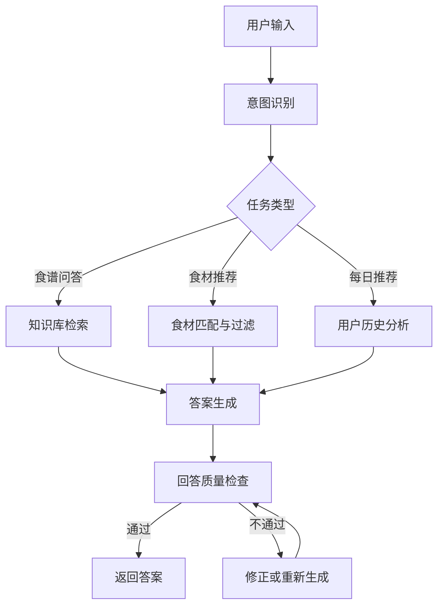

# KitchenPilot 项目规划

## 1. 项目名称

英文名称暂定为：

**KitchenPilot: 面向厨房新手的个性化食谱 Agentic RAG 助手**

中文名称暂定为：

**小厨子：面向厨房新手的食谱推荐与问答系统**

## 2. 项目定位

KitchenPilot 面向厨房新手，帮助用户解决日常做饭中的常见问题：

- 不知道今天做什么菜
- 不知道已有食材能做什么
- 不知道某道菜难不难
- 不知道食材是否常见、是否当季
- 不知道做菜失败的原因
- 希望根据自己之前做过的菜获得每日推荐

项目核心目标是构建一个基于 **LangGraph** 的 **Agentic RAG 食谱助手**，结合结构化食谱库、向量检索、用户做菜历史和推荐算法，为厨房新手提供可靠、可溯源、个性化的做菜指导。

## 3. 目标用户

### 3.1 主要用户

- 厨房新手
- 学生、独居人群、租房人群
- 想用家中现有食材快速做饭的人
- 想学习基础家常菜的人

### 3.2 用户特点

- 缺少烹饪经验
- 对火候、调料、步骤顺序不熟悉
- 更关注简单、低失败率、食材常见的菜品
- 需要明确、可执行、风险较低的做菜建议

## 4. 核心功能

### 4.1 食谱知识库

系统会维护自己的结构化食谱数据。食谱数据不只是普通文本，而是可检索、可过滤、可分析的结构化知识库。

每条食谱建议包含以下字段：

- 菜名
- 食材
- 调料
- 做法步骤
- 烹饪时间
- 烹饪难度
- 是否适合新手
- 食材常见性
- 食材季节性
- 常见失败点
- 替代食材
- 注意事项

知识库的主要作用：

- 支持 RAG 检索
- 支持按食材、难度、时间、季节等条件过滤
- 支持推荐算法计算
- 支持回答溯源和质量检查

### 4.2 RAG 问答功能

用户可以围绕具体菜品、食材、步骤和失败原因提问，例如：

- 土豆丝怎么炒得脆？
- 番茄炒蛋怎么做？
- 可乐鸡翅怎么避免太甜？
- 没有生抽可以用什么替代？
- 新手做红烧肉要注意什么？

系统处理流程：

1. 识别用户问题意图
2. 从食谱知识库中检索相关菜谱、步骤、技巧和失败点
3. 将检索结果作为上下文交给大模型生成答案
4. 对答案进行质量检查
5. 返回带依据、可执行、适合新手的回答

该功能的目标是避免大模型直接胡编菜谱或给出没有依据的建议。

### 4.3 食材分析与菜品推荐

用户可以输入已有食材，例如：

> 我家里有鸡蛋、番茄、土豆，推荐一道简单菜。

系统会分析：

- 已有食材能匹配哪些菜
- 缺少哪些关键食材
- 食材是否常见
- 食材是否适合当前季节
- 菜品难度是否适合新手
- 预计烹饪时间是否符合要求

推荐结果应包含：

- 推荐菜名
- 推荐理由
- 已有食材匹配情况
- 缺少食材
- 难度说明
- 预计烹饪时间
- 简要做法
- 新手注意事项

### 4.4 每日推荐功能

系统会记录用户之前做过的菜和反馈，例如：

- 做过番茄炒蛋，评分高
- 做过红烧肉，觉得太难
- 喜欢鸡蛋类、土豆类菜
- 不喜欢太复杂的肉菜

每日推荐会综合考虑：

- 用户做菜历史
- 用户偏好
- 近期是否重复推荐
- 菜品难度
- 食材常见性
- 季节性
- 预计烹饪时间

推荐目标：

- 降低用户选择成本
- 避免重复推荐
- 优先推荐新手友好菜品
- 根据用户反馈逐步个性化

### 4.5 回答质量检查

系统需要对最终答案进行检查，避免出现以下问题：

- 没有根据知识库就生成答案
- 推荐的菜不符合用户已有食材
- 把复杂菜说成新手友好
- 遗漏关键步骤
- 给出危险烹饪建议
- 输出格式不符合要求

质量检查可以作为 LangGraph 中的独立节点，对生成结果进行审核、修正或要求重新生成。

## 5. Agentic RAG 设计

### 5.1 核心思想

项目不是简单的“检索后回答”，而是通过 LangGraph 构建多节点工作流，让系统根据用户问题类型选择不同处理路径。

### 5.2 推荐工作流



### 5.3 主要节点

- **意图识别节点**：判断用户是问菜谱、问技巧、问替代食材、做食材推荐，还是请求每日推荐。
- **检索节点**：从向量库和结构化数据库中检索相关食谱与知识片段。
- **食材匹配节点**：根据用户已有食材匹配可做菜品。
- **用户画像节点**：读取用户历史、评分和偏好。
- **推荐排序节点**：综合难度、时间、季节性、匹配度和偏好进行排序。
- **答案生成节点**：基于检索结果生成自然语言回答。
- **质量检查节点**：检查答案是否有依据、是否符合约束、是否适合新手。

## 6. 数据设计

### 6.1 食谱数据

建议食谱数据使用结构化格式存储，例如 JSON、关系型数据库或文档数据库。

示例字段：

```json
{
  "id": "recipe_tomato_egg",
  "name": "番茄炒蛋",
  "ingredients": ["番茄", "鸡蛋"],
  "seasonings": ["盐", "糖", "食用油"],
  "steps": [
    "鸡蛋打散，番茄切块",
    "热锅倒油，先炒鸡蛋后盛出",
    "再炒番茄至出汁",
    "倒回鸡蛋，加入盐调味"
  ],
  "time_minutes": 15,
  "difficulty": "easy",
  "beginner_friendly": true,
  "common_ingredients": true,
  "seasonality": ["spring", "summer", "autumn", "winter"],
  "common_failures": ["鸡蛋炒老", "番茄不出汁", "调味过甜"],
  "substitutions": {
    "糖": "可省略或少量使用"
  },
  "notes": ["鸡蛋不要炒太久", "番茄可以先加少量盐帮助出汁"]
}
```

### 6.2 用户历史数据

用户历史数据可包含：

- 用户 ID
- 做过的菜
- 做菜时间
- 用户评分
- 难度反馈
- 口味偏好
- 不喜欢的食材或菜品类型
- 最近推荐记录

示例字段：

```json
{
  "user_id": "user_001",
  "cooked_recipes": [
    {
      "recipe_id": "recipe_tomato_egg",
      "rating": 5,
      "difficulty_feedback": "简单",
      "cooked_at": "2026-05-08"
    }
  ],
  "preferences": {
    "liked_ingredients": ["鸡蛋", "土豆"],
    "disliked_styles": ["复杂肉菜"],
    "max_time_minutes": 30
  },
  "recent_recommendations": ["recipe_tomato_egg"]
}
```

## 7. 技术方案

### 7.1 后端核心

- **LangGraph**：构建 Agentic 工作流
- **LangChain**：连接模型、检索器和工具
- **向量数据库**：存储食谱文本片段和技巧知识
- **结构化数据库**：存储食谱字段、用户历史和推荐记录
- **Embedding 模型**：用于语义检索
- **LLM**：用于意图识别、答案生成和质量检查

### 7.2 检索方案

建议采用混合检索：

- 结构化检索：按食材、难度、时间、季节、是否新手友好过滤
- 向量检索：按问题语义检索相关菜谱、技巧和失败点
- 排序融合：综合匹配度、难度、时间、用户偏好进行排序

### 7.3 推荐方案

推荐分数可由多个因素加权计算：

- 食材匹配度
- 用户偏好匹配度
- 新手友好程度
- 烹饪时间适配度
- 食材常见性
- 季节适配度
- 最近是否重复推荐
- 用户历史评分

## 8. 输出格式设计

### 8.1 食谱问答输出

建议包含：

- 简短结论
- 具体做法或原因解释
- 新手注意事项
- 依据来源，例如相关菜谱或知识库片段

### 8.2 食材推荐输出

建议包含：

- 推荐菜品
- 推荐理由
- 已有食材
- 还需补充的食材
- 难度和耗时
- 简要步骤
- 常见失败点

### 8.3 每日推荐输出

建议包含：

- 今日推荐菜
- 为什么适合你
- 与历史偏好的关系
- 是否有重复推荐风险
- 新手提醒

## 9. 项目里程碑

### 阶段一：基础知识库与问答

- 设计食谱数据结构
- 准备首批结构化食谱数据
- 构建基础向量索引
- 实现基于 RAG 的食谱问答
- 实现回答引用和依据展示

### 阶段二：食材推荐

- 实现食材解析
- 实现食材与菜谱匹配
- 实现缺失食材分析
- 加入难度、时间、季节性过滤
- 输出推荐理由

### 阶段三：用户历史与每日推荐

- 设计用户历史数据结构
- 记录用户做菜历史和反馈
- 实现用户偏好建模
- 实现每日推荐排序
- 避免近期重复推荐

### 阶段四：Agentic 工作流与质量检查

- 使用 LangGraph 串联各节点
- 实现意图识别节点
- 实现推荐排序节点
- 实现质量检查节点
- 对不合格回答进行修正或重生成

### 阶段五：产品化与评估

- 构建简单前端或 API 服务
- 增加日志和错误处理
- 设计测试集评估回答质量
- 评估推荐准确性和用户满意度
- 优化提示词、检索策略和推荐权重

## 10. 项目亮点

- 面向真实厨房新手场景，而不是泛泛的聊天助手
- 使用结构化食谱库，方便检索、过滤和推荐
- 结合 RAG，降低大模型胡编菜谱的风险
- 引入用户历史，实现个性化每日推荐
- 使用 LangGraph 构建可控的 Agentic 工作流
- 加入回答质量检查，提高可靠性和安全性

## 11. 预期成果

项目完成后，系统应能够：

- 回答常见家常菜做法和技巧问题
- 根据已有食材推荐新手友好菜品
- 分析缺少食材和替代方案
- 根据用户历史生成每日推荐
- 对回答进行质量检查，减少不可靠输出
- 提供可追溯的食谱依据和推荐理由

