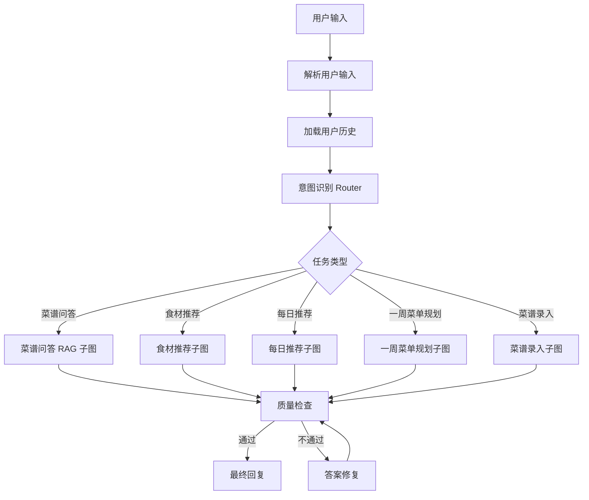
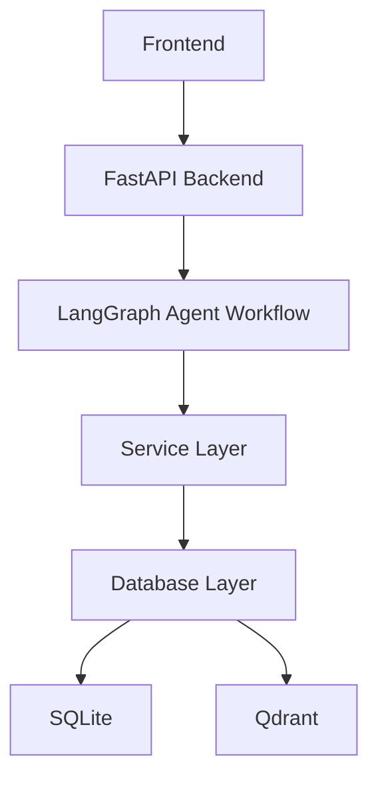

# KitchenPilot 技术选型与架构说明

## 1. 为什么使用 RAG

KitchenPilot 使用 RAG 的核心原因是：做饭指导需要依据具体食谱、步骤、技巧和注意事项，不能完全依赖大模型自身记忆。

如果直接让大模型回答，可能会出现以下问题：

- 编造菜谱步骤
- 推荐不存在或不合理的食材搭配
- 遗漏关键注意事项
- 给出不适合新手的建议
- 生成危险烹饪操作

RAG 的优势是：

- 先检索知识库，再生成答案
- 答案可以基于具体食谱来源
- 减少大模型幻觉
- 支持持续更新自己的食谱库
- 可以结合用户自己的做菜经验

在项目中，RAG 主要负责：

- 菜谱问答
- 烹饪技巧解释
- 失败原因分析
- 替代食材建议
- 新手注意事项生成

## 2. 为什么使用 Agent

KitchenPilot 不是简单问答系统，而是一个多步骤任务系统。

例如用户可能会问：

> 我家里有鸡蛋和土豆，推荐一道新手菜，顺便告诉我怎么做，如果缺调料也告诉我能不能替代。

这个问题需要多个步骤：

1. 理解用户需求
2. 分析已有食材
3. 查询菜谱库
4. 计算推荐分数
5. 检索做法和技巧
6. 判断缺少的调料
7. 寻找替代方案
8. 检查回答是否安全可靠
9. 生成最终回答

因此需要 Agent 负责流程调度。

在这个项目中：

- **RAG** 负责知识检索和可靠回答
- **Agent** 负责决定调用哪些工具、执行哪些步骤、是否需要检查和修复

所以项目更准确的定位是：

**Agentic RAG 系统**

## 3. Agent 拓扑结构

项目使用 LangGraph，因此采用：

**Router-based Hierarchical Agent Graph**

也就是：

**意图路由 + 多任务子图 + 工具调用 + 质量检查闭环**

整体流程如下：



该结构比单纯 ReAct Agent 更适合本项目，原因是：

- 推荐逻辑需要可控
- 食品安全需要校验
- RAG 回答需要强制引用知识库
- 用户历史和食材分析需要明确计算
- 项目更容易测试和展示

## 4. 项目整体架构

推荐架构如下：



### 4.1 前端层

前端层负责用户交互和结果展示。

主要模块：

- 聊天界面
- 推荐结果展示
- Agent 执行过程展示
- 菜谱详情页

### 4.2 后端层 FastAPI

FastAPI 负责对外提供 API 服务。

主要接口：

- 用户请求接口
- 菜谱查询接口
- 推荐接口
- 问答接口
- 用户历史接口

### 4.3 Agent 层 LangGraph

LangGraph 负责组织 Agent 工作流。

主要节点：

- 意图识别节点
- RAG 问答子图
- 食材推荐子图
- 每日推荐子图
- 质量检查节点
- 答案修复节点

### 4.4 服务层

服务层封装具体业务逻辑，避免 Agent 节点直接操作数据库或向量库。

建议服务：

- `RecipeService`
- `IngredientService`
- `RecommendationService`
- `RAGService`
- `UserMemoryService`
- `SafetyCheckService`

### 4.5 数据层

数据层负责结构化数据和向量数据存储。

当前推荐组合：

- SQLite：存储业务数据
- Qdrant：存储向量数据

## 5. 数据库方案：SQLite + Qdrant

当前选择：

**SQLite 存业务数据，Qdrant 存向量数据。**

这是一个适合当前项目阶段的组合，既能快速落地，也能体现 AI 应用的工程化能力。

## 6. SQLite 负责什么

SQLite 用来存储结构化数据。

### 6.1 recipes

用于存储菜谱主信息：

- 菜谱 ID
- 菜名
- 描述
- 难度
- 预计时间
- 是否适合新手
- 菜系
- 季节标签

### 6.2 ingredients

用于存储食材基础信息：

- 食材 ID
- 食材名称
- 类别
- 常见性分数
- 季节标签

### 6.3 recipe_ingredients

用于存储菜谱和食材的关联关系：

- 菜谱 ID
- 食材 ID
- 用量
- 是否必需

### 6.4 recipe_steps

用于存储菜谱步骤：

- 菜谱 ID
- 步骤编号
- 步骤内容
- 新手提示
- 风险提示

### 6.5 user_cooking_history

用于存储用户做菜历史：

- 用户 ID
- 菜谱 ID
- 评分
- 反馈
- 做菜时间

### 6.6 qa_logs

用于存储问答记录和质量检查结果：

- 用户问题
- 检索到的内容
- 生成答案
- 检查结果

SQLite 适合处理：

- 查询某道菜的完整信息
- 根据食材筛选候选菜谱
- 记录用户做菜历史
- 存储用户评分和反馈
- 支持推荐算法计算

## 7. Qdrant 负责什么

Qdrant 用来存储向量数据，也就是 RAG 检索需要的 embedding。

食谱可以切成多个 chunk，例如：

- 番茄炒蛋的食材准备
- 番茄炒蛋的详细步骤
- 番茄炒蛋的新手注意事项
- 土豆丝炒不脆的原因
- 可乐鸡翅太甜的调整方法
- 生抽的替代方案

每个 chunk 生成 embedding 后存入 Qdrant。

Qdrant 中可以存储如下 payload：

```json
{
  "recipe_id": 12,
  "recipe_name": "酸辣土豆丝",
  "chunk_type": "failure_reason",
  "content": "土豆丝切好后需要用清水冲洗表面淀粉，否则容易粘锅且口感不脆。",
  "metadata": {
    "difficulty": "easy",
    "ingredients": ["土豆", "醋", "辣椒"],
    "beginner_friendly": true
  }
}
```

当用户问：

> 土豆丝怎么炒得脆？

系统会在 Qdrant 中检索相关 chunk，再交给 LLM 生成回答。

## 8. 为什么选择 SQLite

选择 SQLite 的原因：

- 上手简单
- 不需要单独安装数据库服务
- 一个 `.db` 文件就能运行
- Python 原生支持好
- 适合个人项目 MVP
- 适合存储结构化食谱数据和用户历史
- 后期可以用 SQLAlchemy 平滑迁移到 MySQL 或 PostgreSQL

相比 MySQL：

- MySQL 更适合正式生产系统
- MySQL 需要安装服务、配置账号、端口和权限
- 对当前个人项目来说，MySQL 的复杂度偏高

所以当前阶段 SQLite 更合适。

## 9. 为什么选择 Qdrant

选择 Qdrant 的原因：

- 专门用于向量检索
- 适合 RAG 场景
- 支持 metadata 过滤
- 比自己用 SQLite 存 embedding 更专业
- 工程感更强
- 方便和 LangChain 集成
- 后期可以用 Docker 部署

项目需要根据自然语言问题找到相关菜谱技巧，例如：

- 怎么让土豆丝更脆
- 鸡翅太甜怎么办
- 没有生抽怎么替代

这些问题不一定和菜谱原文关键词完全一致，所以需要语义检索。Qdrant 负责这个部分。

## 10. 为什么暂时不用 Redis、Neo4j、MySQL

### 10.1 Redis

Redis 适合：

- 缓存
- 会话管理
- 限流
- 任务队列
- 热点数据加速

但 MVP 阶段不需要这些功能，所以先不用。

### 10.2 Neo4j

Neo4j 是图数据库，适合构建复杂关系网络，例如：

- 食材搭配图谱
- 食材替代图谱
- 菜系关系图
- 营养关系图

但前期这些关系用 SQLite 表也能表达。

例如食材替代可以先用一张表：

```text
ingredient_substitutions
- ingredient_id
- substitute_id
- reason
```

所以 Neo4j 目前属于过度设计。

### 10.3 MySQL

MySQL 更接近企业生产系统，但对当前项目来说不是必须。

可以先用 SQLite 快速完成项目闭环。后期如果想增强工程化能力或支持多用户并发，再迁移到：

- MySQL
- PostgreSQL

## 11. 项目技术栈总结

| 层级 | 技术 |
| --- | --- |
| Agent 编排 | LangGraph |
| RAG 组件 | LangChain |
| 后端服务 | FastAPI |
| 结构化数据库 | SQLite |
| 向量数据库 | Qdrant |
| 数据建模 | Pydantic |
| ORM | SQLAlchemy |
| LLM | OpenAI / ModelScope / Ollama Qwen |
| Embedding | bge-small-zh / bge-m3 / text-embedding 模型 |
| 前端 | Streamlit 或 React |
| 部署 | Docker Compose |

## 12. 技术选型原因总结

### 12.1 LangGraph

选择原因：

- 适合构建可控的 Agent 工作流
- 支持节点、边、条件路由和循环
- 适合实现意图识别、任务子图、质量检查和答案修复
- 比普通 ReAct Agent 更稳定
- 方便展示 Agent 执行轨迹

### 12.2 LangChain

选择原因：

- 生态成熟
- 方便接入 Retriever、VectorStore、Prompt、Tool、OutputParser
- 适合实现 RAG 检索和 LLM 调用
- 可以和 LangGraph 配合使用
- 招聘需求中出现频率高

### 12.3 FastAPI

选择原因：

- 轻量、现代、易上手
- 适合 Python AI 项目
- 接口文档自动生成
- 方便对接前端
- 适合封装 Agent 服务

### 12.4 SQLite

选择原因：

- 上手最快
- 部署简单
- 适合个人项目
- 适合存储菜谱、食材、用户历史等结构化数据
- 后期可迁移到 MySQL 或 PostgreSQL

### 12.5 Qdrant

选择原因：

- 专业向量数据库
- 适合 RAG 语义检索
- 支持 metadata 过滤
- 工程化程度高
- 适合存储菜谱 chunk embedding
- 能和 LangChain 集成

### 12.6 Pydantic

选择原因：

- 定义结构化食谱 Schema
- 校验 LLM 输出格式
- 减少自由文本解析错误
- 提高系统稳定性
- 适合 FastAPI 和 LangGraph 状态管理

## 13. 需要讨论和确认的点

以下几点不是明显错误，但建议在正式实现前确认范围。

### 13.1 MVP 是否包含一周菜单规划和菜谱录入

当前 Agent 拓扑中包含：

- 一周菜单规划子图
- 菜谱录入子图

这两个功能很适合后续扩展，但如果第一版目标是快速完成可展示闭环，建议 MVP 先聚焦：

- 菜谱问答
- 食材推荐
- 每日推荐
- 回答质量检查

一周菜单规划和菜谱录入可以放到第二阶段。

### 13.2 Qdrant 的运行方式

Qdrant 可以通过 Docker、本地服务或内存模式运行。当前项目提供 Docker Compose 配置，便于本地复现；开发早期也可以先用本地轻量方式降低配置成本。

### 13.3 Embedding 模型选择

如果主要处理中文食谱，`bge-small-zh` 或 `bge-m3` 是合理选择。

如果使用 OpenAI 的 embedding 模型，需要考虑：

- 网络和 API Key 配置
- 成本
- 中文效果
- 与本地模型方案的一致性

### 13.4 LLM 选择

OpenAI、ModelScope、Ollama Qwen 都可以作为候选，但建议项目配置上做成可切换 Provider。

这样可以支持：

- 本地开发用 Ollama Qwen
- 在线效果验证用 OpenAI 或 ModelScope
- 后期根据成本和效果调整

### 13.5 食品安全检查不应只依赖 LLM

质量检查节点可以使用 LLM，但涉及安全的规则最好同时做成显式规则，例如：

- 生熟分离提醒
- 肉类、禽类、海鲜需要充分加热
- 油锅、高温、压力锅等危险操作提示
- 过敏原提示
- 不推荐处理变质食材

这样比完全依赖 LLM 判断更稳定。
